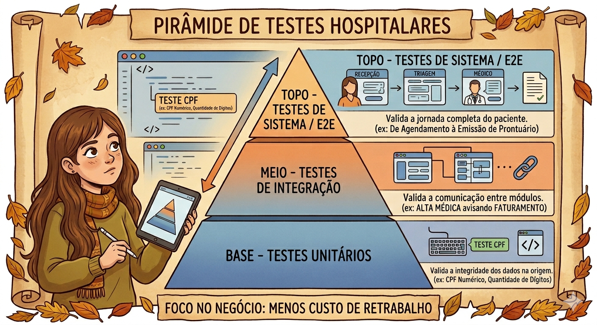

# 🏥 Estudo de Caso: Pirâmide de Testes no Setor Hospitalar

Neste estudo, aplico os conceitos da **Pirâmide de Testes** em um cenário real de alta complexidade: a jornada de um paciente em um sistema de gestão hospitalar (ERP).

O objetivo deste modelo é garantir a qualidade desde a base, reduzindo custos de retrabalho e garantindo a segurança do usuário final.

---

## 🔼 A Pirâmide na Prática

### 1. Base: Testes Unitários (Unit Tests) 🌱
**Foco:** Validar a menor unidade de código de forma isolada.
* **Exemplo:** Validação do campo de CPF no cadastro do paciente.
* **O que é testado:** Se o sistema aceita apenas números, possui a quantidade correta de dígitos e se a lógica do dígito verificador funciona.
* **Por que é a base:** É o teste mais rápido e barato. Se o dado nasce errado aqui, ele quebra o faturamento e o prontuário lá na frente.

### 2. Meio: Testes de Integração (Integration Tests) 🌸
**Foco:** Validar a "conversa" entre diferentes módulos do sistema.
* **Exemplo:** O fluxo de **Alta Hospitalar**.
* **O que é testado:** Quando o médico registra a alta, o sistema deve integrar a informação com:
    * **Faturamento:** Para fechamento da conta.
    * **Hotelaria:** Para limpeza e liberação do leito.
* **Objetivo:** Garantir que a informação não se perca entre as "paredes" do sistema.

### 3. Topo: Testes de Sistema / E2E (End-to-End) ☀️
**Foco:** Validar a jornada completa do usuário através da interface (UI).
* **Exemplo:** Fluxo completo da Emergência.
* **O que é testado:** O caminho feliz: Recepção -> Triagem -> Atendimento Médico -> Emissão de Documentos.
* **Objetivo:** Simular o uso real do sistema e garantir que o fluxo principal está fluido e sem travamentos.

---

## 🧠 Insights de Aprendizado

> "Trazer minha bagagem do suporte para o QA me permite entender que um 'bug' no topo da pirâmide muitas vezes é o sintoma de um teste que faltou na base. O foco no negócio é o que diferencia um teste comum de uma estratégia de qualidade real."

--
--

--

--

---
## 🧠 Refinamento de Requisitos e Shift Left (Análise de Ambiguidade)

Além dos níveis de teste, aplico a mentalidade de **Shift Left**, que consiste em atuar no início do processo (análise de requisitos) para identificar "fios soltos" e ambiguidades antes do desenvolvimento começar.

### Exemplo Prático: O Cenário do "Médico em Transição"

Exemplo: O 'Fio Solto' da Parametrização Hospitalar

-> Requisito Inicial: "O médico escolhe sua tela inicial." (Muito ambíguo!)

-> Questionamento de QA: E se o RH mudar o setor do médico e ele perder o acesso àquela tela escolhida?

-> Critério de Aceitação Final: O sistema deve validar a permissão antes de carregar a tela favorita. Se não houver permissão, o sistema deve carregar o Dashboard Padrão (comunicação interna/agenda).

### 🔍 Traduzindo Ambiguidade em Qualidade

| Cenário (O "Fio Solto") | Questionamento de QA (Shift Left) | Resultado (Critério de Aceitação) |
| :--- | :--- | :--- |
| **Primeiro Acesso** | O médico é novo e não tem tela favorita. O sistema trava? | **CA 1:** Definir "Dashboard Geral" como tela padrão inicial. |
| **Troca de Setor** | O médico mudou de setor e perdeu acesso à favorita. | **CA 2:** Sistema valida permissão e faz *fallback* para tela de avisos. |
| **Tempo de Resposta** | "O sistema deve ser rápido ao carregar." (Quanto é rápido?) | **CA 3:** A tela inicial deve carregar em no máximo 3 segundos. |

Valor Gerado: Menos chamados no suporte e uma transição de setor mais suave para o usuário.

### 💡 Por que isso importa?
Identificar essas lacunas no planejamento evita:
1. **Retrabalho do Desenvolvedor:** Que não precisará refazer a lógica depois.
2. **Chamados no Suporte:** Evita que o usuário encontre telas de erro por falta de permissão.
3. **Frustração do Usuário:** Garante uma experiência fluida mesmo em cenários de exceção.

