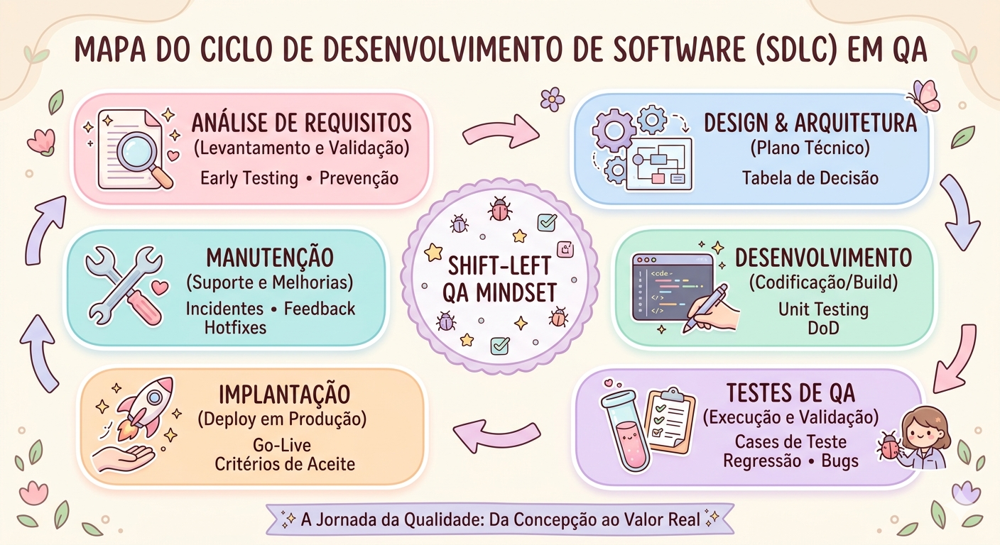
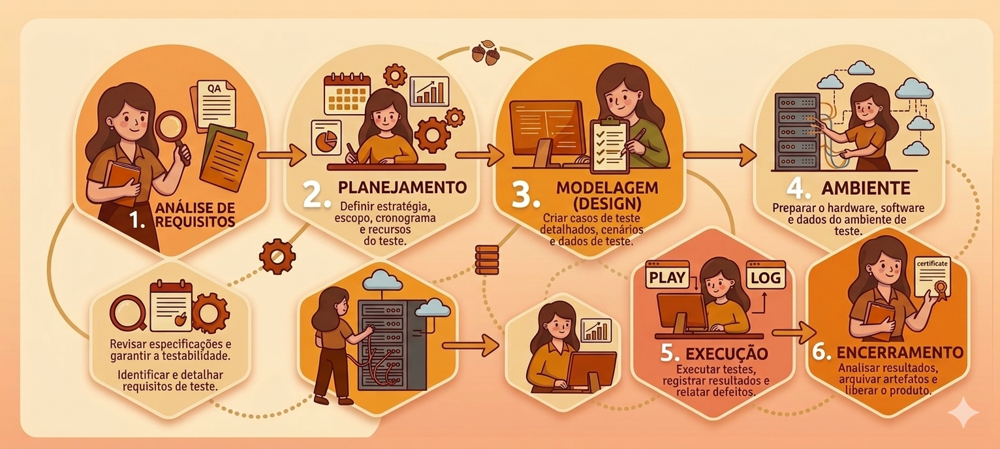

# 📚 Sumário de Estudos

Navegue pelos módulos de aprendizado deste repositório:

* 🔼 [Estratégia: Pirâmide de Testes Hospitalar](./PIRAMIDE-DE-TESTES.md)
* 📝 [Prática: Escrita de Cenários e Análise de Requisitos](./CENARIOS-DE-TESTE.md)
* ⚙️ [Fundamentos: Ciclo de Vida do Software (SDLC)](#) *(Em breve)*

***

# 📚 Meus Estudos de QA: Fundamentos e SDLC

Bem-vindos ao meu cantinho de estudos! ✨ Aqui documento minha transição do suporte para a Engenharia de QA.

## 🧬 O que aprendi sobre SDLC (Ciclo de Vida de Desenvolvimento de Software)
Entendi que a qualidade não é uma fase isolada, mas um hábito que percorre todo o caminho do software.
Que QA não é só encontrar falhas e sim a prevenção, reduzindo custos, evitar retrabalho, melhorar a qualidade do software e aumentar a satifação do cliente.

### 🔍 Meus Insights Principais:
- **Early Testing:** Quanto mais cedo o QA entra (especialmente nos Requisitos), mais bugs evitamos.
- **Custo do Defeito:** Corrigir um erro na fase inicial é muito mais barato e menos estressante do que um "incêndio" em produção! 📉
- **Mindset de Prevenção:** Saí do modo "caçar erro" para o modo "garantir que o valor seja entregue".

- Ter um ciclo claro e bem gerido, assegura que o produto final atenda as expectativas do cliente, com um software de qualidade, seguro e se mantenha relevante ao longo do tempo.

---
### 🗺️ Mapa do SDLC

---

---

## 🧪 O que aprendi sobre STLC (Software Testing Life Cycle)

O STLC é o processo específico que garante a qualidade em cada etapa do teste. Diferente de apenas "procurar erros", ele segue uma ordem lógica:

1. **Análise de Requisitos:** Validar se os requisitos são testáveis.
2. **Planejamento:** Definir estratégia, ferramentas e cronograma.
3. **Modelagem (Design):** Criação dos casos de teste e cenários.
4. **Ambiente:** Preparação da infraestrutura (homologação).
5. **Execução:** Rodar os testes e reportar os bugs encontrados.
6. **Encerramento:** Analisar métricas e validar a prontidão do software.

Ao seguir um fluxo estruturado, o QA não está apenas ''caçando bugs'', está construindo previsibilidade, segurança e confiança na entrega. 
Seguir o STCL é mais do que organização, é transformar o teste em um pilar estratégico para a qualidade final do software.

---
### 🗺️ Mapa do STLC
 

